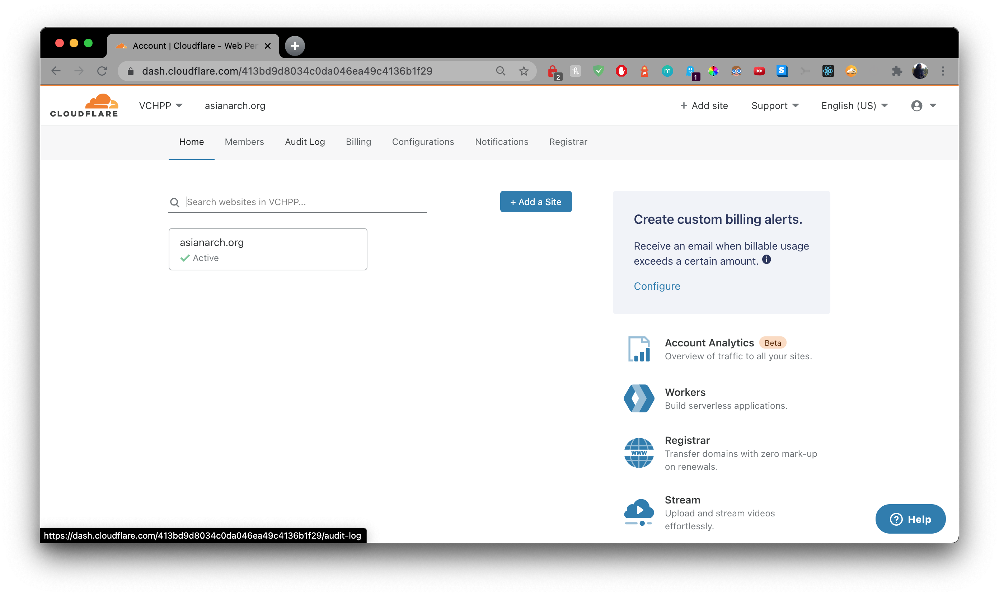
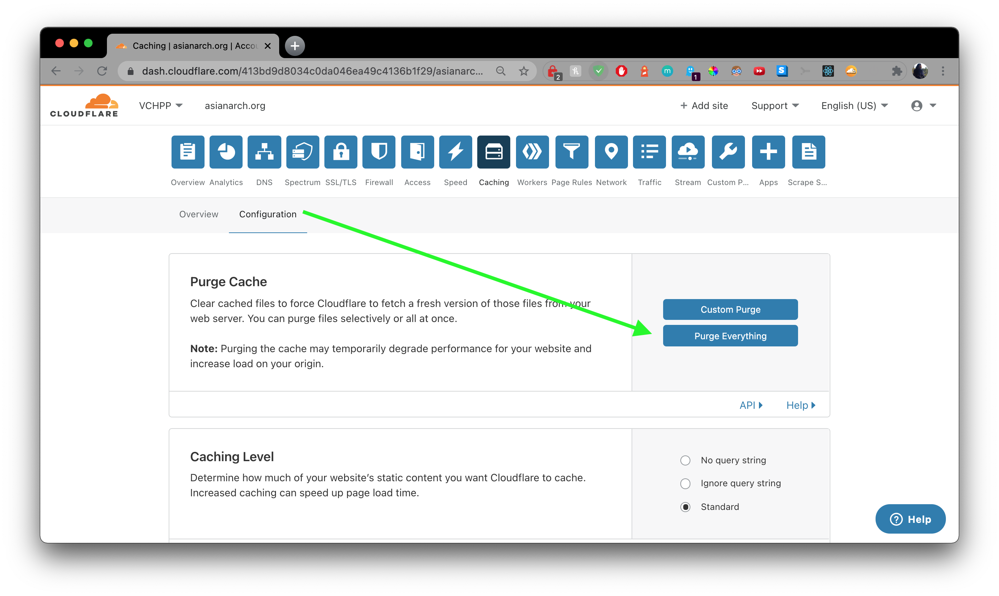

# Asianarch.org

## High level tech overview

Currently, this website is hosted here, on Github Pages, and is using Cloudflare to serve it securely and protect it on the edge network.

## How to contribute

### Prerequisites

* Github.com account
* Cloudflare account
* Use of your computer's terminal
* An integrated development environment (IDE) like Sublime, Atom, or VS Code

You'll need to make accounts for the above PaaS (Platform as a Service) in order to be able to contribute towards these projects.  Once you have done so, please reach out to justincadburywong@gmail.com in order to be invited to the respective organizations.

You'll also need a local copy of this repository, along with `git`.  `git` is a version control software that will keep track of any changes.

Start by following the instructions [here](https://git-scm.com/book/en/v2/Getting-Started-Installing-Git) to install git.  

Once that's done, use your terminal and move to a working directory where you will keep the copy of the website on your computer.  Copy the command into your computer's terminal, omitting the `$`:

```
$ git clone https://github.com/vchpp/asianarch.git
```
This will download the website's `main` branch onto your computer.  You're now ready to work.

### Always have the latest copy

```
$ git checkout main
$ git pull
```

Start by making sure you're on the `main` branch, and running this every time to update your local copy.  This should download any and all latest changes, and is very important that you do this each time you want to make an edit, even if you were the last one to do so.

Next, start your work by 'checking out' a new branch, with

```
$ git checkout -b <BRANCH NAME>
```
where `<BRANCH NAME>` follows the 6 digit date, as MMDDYY.  
For example, `$ git checkout -b 030221`.

You should now be working on the branch we'll edit.  Should you make any mistakes, you can revert back to the main branch without committing any new changes.

### Make edits in your IDE

Fire up your IDE and make updates and changes to your HTML, images, scripts as necessary.  As you make changes, you can check on the files that were modified by using `$ git status` to see any of the tracked, untracked, and committed changes.  You can check your work also by loading the `index.html` file locally in your browser with `file:///path/to/file/asianarch/index.html` and navigate around to find your changes.

Once you're done with your changes, you'll need to commit them to the working branch.  In your terminal, type

```
$ git add <FILENAME>
```  
You may have to do this successive times, or, if there are only modified files that already existed, and you want to add them all, you can use `$ git add *`.  Be careful when using this last option - it's safer to track individual files than it is to track unwanted files accidentally.  

Lastly, to commit those files to the branch, you'll need a commit message.  Again in your terminal, type in

```
$ git commit -m "<BRANCH NAME> <MESSAGE>"
```  
For the above example, it might look like this: `$ git commit -m "030221 add readme.md"`

### Publish your changes

Once all the files on your working branch have been committed, you're going to want to push them upstream to the hosting server to publish those changes.  Do so with the following command:

```
$ git push origin <BRANCH NAME>
```

The above command will push the local branch to the origin upstream.  I think that's evident.  You'll be asked for your Github username and password if it hasn't been stored locally by a credential manager.  Once it's pushed up, you'll see a link to create a Pull Requet has been generated.  You can follow that link, or simply go to `https://github.com/vchpp/asianarch/compare`.  You're going to be creating a Pull Request for your branch against the `main` branch.  Once you do that, you can feel free to merge the changes.  Once they're merged, it'll take 5 minutes to build and publish globally.

At this time, it would be a good idea to `$ git checkout main` and `$ git pull` again, so that you are ready for the next exit, when it comes along.  Don't forget to `$ git pull` again before starting work, as there may have been changes since your last edit.

### Clear the Cloudflare cache

Now that the origin server on Github has fresh content, you're going to want to clear the stale cache at Cloudflare.  Log in to the [Cloudflare dashboard](https://dash.cloudflare.com)



Under the Asianarch.org zone, turn on Development Mode on the homepage (this is also on the Caching page halfway down).  This will bypass the stale cache on Cloudflare and let you look at the content directly from the origin on Github.  


This way you can see exactly when Github begins hosting the latest content.  Once you see your changes, you can purge the entire cache and disable Development Mode.



Finally, Cloudflare will serve the most to date content, and you are all finished.

## Best Practices/Interesting considerations

* You can keep comments in your HTML page to remind you what changes you've made, how you've previously formatted other sections, etc.  Cloudflare's HTML minification will strip out the comments, so they're not made public, which saves filesize as well as embarassment.
